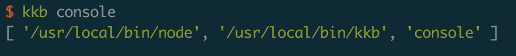

## 学习使用node来制作一个cli

Node.js用途很广，常用来开发服务、桌面应用等被开发者熟知，Node.js还有另外一个非常实用的场景 - 命令行应用（后文统称CLI）。本文将介绍CLI的开发流程、常用的功能，并以meet-cli为例实战演练，从零开始一步步开发一个可以在生产中使用（read world）的CLI工具。

### cli是什么？

Command Line Interface，顾名思义是一种通过命令行来交互的工具或者说应用。SPA应用中常用的如vue-cli, angular-cli, node.js开发搭建express-generator，orm框架sequelize-cli，还有我们最常用的webpack，npm等。他们是web开发者的辅助工具，旨在减少低级重复劳动，专注业务提高开发效率，规范develop workflow。

举比较典型的angular-cli 为例，它可以让angular开发者快速创建最佳实践的angular应用，快速启动，快速创建component、directive、pipe、service、module等，用过的都说很好用，现在各个框架都有配套CLI。

CLI的根据不同业务场景有不同的功能，但万变不离其宗，本质都是通过命令行交互的方式在本地电脑运行代码，执行一些任务。 

### cli有什么好处？

我们可以从工作中总结繁杂、有规律可循、或者简单重复劳动的工作用CLI来完成，只需一些命令，快速完成简单基础劳动。以下是我对现有工作中的可以用CLI工具实现的总结举例：

- 快速生成应用模板，如vue-cli等根据与开发者的一些交互式问答生成应用框架
- 创建module模板文件，如angular-cli，创建component,module；sequelize-cli 创建与mysql表映射的model等
- 服务启动，如ng serve
- eslint，代码校验，如vue,angular，基本都具备此功能
- 自动化测试 如vue,angular，基本都具备此功能
- 编译build，如vue,angular，基本都具备此功能
- 编译分析，利用webpack插件进行分析
- git操作
- 生成的代码上传CDN
- 还可以是小工具用途的功能，如http请求api、图片压缩、生成雪碧图等等，只要你想做的都能做

### 与npm scripts的对比

npm scripts也可以实现开发工作流，通过在package.json中的scripts对象配置相关npm命令，执行相关js来达到相同的目的。

但是cli工具与npm scripts相比有什么优势呢?

1.  npm scripts是某个具体项目的，只能在该项目内使用，cli可以是全局安装的，多个项目使用；
2. 使用npm scripts 在业务工程里面嵌入工作流，耦合太高；使用cli 可以让业务代码工作流相关代码剥离，业务代码专注业务
3. cli工具可以不断迭代开发，演进，沉淀。 

### 常用库使用

使用node制作一个cli库经常要用到以下几个常用的库：

#### [commander] (https://github.com/tj/commander.js/)

**commander**是node.js的命令行解决方案。我们可以通过 **commander** 的 option 方法，来定义 **commander** 的选项，当然，这些定义的选项也会被作为该命令的帮助文档。

- version: 用来定义版本号。**commander** 默认帮我们添加 -V, --version 选项。当然，我们也可以重设它。
- command：<> 代表必填，[] 代表选填。当 **.command()** 带有描述参数时，不能采用 **.action(callback)** 来处理子命令，否则会出错。这告诉 **commander**，你将采用单独的可执行文件作为子命令。
- parse： 解析主进程的参数 **process.argv**, 如果没有此命令则什么都现实不出来。process是node中的一个模块，通过访问**process.argv**我们能轻松愉快的接收通过命令执行node程序时候所传入的参数。 **process.argv**包括 node所执行文件的绝对路径所组成的数组、node.exe绝对路径、所传的参数。

**process.argv** 里面存储内容如下：


#### [download-git-repo](https://www.npmjs.com/package/download-git-repo)

用来**clone** github上的仓库，多用于快速生成模板

#### [ora](https://github.com/sindresorhus/ora)

**terminal spinner**

```
    const process = ora(`下载........`);
    process.start(); // 开始旋转
    await download(repo, desc);
    process.succeed(); // 结束旋转
```
#### [Inquirer](https://github.com/SBoudrias/Inquirer.js/)

terminal常见的交互式命令行用户界面的集合

#### [handlebars](https://handlebarsjs.com/zh/)
一种模板语言，Handlebars 非常适合在 CLI 应用渲染，非 HTML 文本内容，在服务器端呈现纯内容

#### figlet

炫酷的terminal文字工具，多用于欢迎页面

#### chalk

定义terminal文字颜色，区别terminal的不同文字

#### open

用于打开浏览器

#### util
 - **util.promisify** 用于将老式的Error first callback转换为Promise对象，让老项目改造变得更为轻松
 
```
const {promisify} = require("util");
 
// Convert the stat function
const fs = require("fs");
const stat = promisify(fs.stat);
 
// Now usable as a promise!
try {
    const stats = await stat("example.txt");
    console.log("Got stats", stats);
} catch (err) {
    console.error("Yikes!", err);
}
```

### 制作cli

完成一个vue-cli的简单脚手架，快速生成应用模板，安装项目，启动服务，以及可以自动配置路由路径。


#### 开始项目

新建一个文件夹，名称起做**vue-tiny-cli**，并在文件夹内 npm init。在 vue-easy-cli 文件夹内，新建 bin 文件夹，并在该文件夹内新建 index.js 文件。紧接着，打开 demo-cli 文件夹内的 package.json 文件，在里面新增如下命令。

```
  {
    "bin": {
        "demo": "./bin/licop.js"
    }
}
```

这句代码的意思是指，在你使用**licop** 命令的时候，会去执行 bin 文件夹下的 index.js 文件。

这时候，我们在 licop.js 文件，写入以下代码。

在 **vue-tiny-cli**目录下依次运行 **npm link**、**licop**，这个时候，你会发现控制台输出了 hello CLI。

> 备注： <br>
>  - #!/usr/bin/env node 告诉操作系统用 Node 来运行此文件 <br>
>  - npm link 作用主要是，在开发 npm 模块的时候，我们会希望边开发边调试。这个时候，npm link 就派上用场了。


```
// licop.js

#!/usr/bin/env node

const program = require("commander")
program.version(require('../package-lock.json').version);
program.command('console')
       .action(function() {console.log(process.argv)});

program
    .command('init <name>')
    .description('init project ')
    .action(require('../lib/init'));

program
    .command('refresh')
    .description('refresh routers an menu')
    .action(require('../lib/refresh'))

program.parse(process.argv);

```

#### 初始化项目

创建lib文件夹，新建init.js文件，使用**licop init myVue**命令可以从github上拉取项目模板，新建项目myVue，安装项目，启动项目，并打开浏览器

代码如下：

```
const {promisify} = require('util');
const figlet = promisify(require('figlet'));
const clear = require('clear');
const chalk = require('chalk');
const log = content => console.log(chalk.green(content));
const {clone} = require('./download');
const open = require('open');

// promisify化spawn
// 对接数据流
const spawn = async (...args) => {
    const {spawn} = require('child_process');
    
    return new Promise(resolve => {
        const proc = spawn(...args);
        // 把子进程的数据流插入主进程中，使得terminal可以打印出子进程的日志
        proc.stdout.pipe(process.stdout);
        proc.stderr.pipe(process.stderr);
        
        proc.on('close', () => {
            resolve();
        })
    })
}

module.exports = async name => {
    // 打印欢迎界面
    clear();
    const data = await figlet('Licop Welcome')
    log(data);

    // clone
    log(`🚀创建项目 ${name}` )
    await clone('github:licop/vue-template', name);
    
    // 自动安装依赖
    log('🔨安装依赖');
    await spawn('cnpm', ['install'], {cwd: `./${name}`});

    log(chalk.green(`
安装完成
To get start
==================
    cd ${name}
    npm run serve
==================
    `));
    open(`http://localhost:8080`)
    // 启动
    await spawn('npm', ['run', 'serve'], {cwd: `./${name}`});
}

```
> 注意：<br/>
> **child_process.spawn()**函数会异步地衍生子进程，可以使用指定的命令行参数创建新进程，且不会阻塞 Node.js 事件循环

#### 创建文件自动生成路由

创建lib文件夹，新建refresh.js文件, 在**myVue**项目中views文件夹下新增一个文件，执行命令**npm refresh**命令则会在页面上自动添加一个路由

```
const fs = require('fs');
const handlebars = require('handlebars');
const chalk = require('chalk');

module.exports = async () => {
    // 获取列表
    const list = fs.readdirSync('./src/views')
        .filter(v => v !== 'Home.vue')
        .map(v => ({
            name: v.replace('.vue', '').toLowerCase(),
            file: v
        }))
    
    // 生成路由定义
    compile({list}, './src/router.js', './template/router.js.hbs')

    // 生成菜单
    compile({list}, './src/App.vue', './template/App.vue.hbs')
    
    /**
     * 模板编译
     * @param {*} meta 数据定义
     * @param {*} filePath 目标文件
     * @param {*} templatePath 模板文件
     */
    function compile(meta, filePath, templatePath) {
        if(fs.existsSync(templatePath)) {
            const content = fs.readFileSync(templatePath).toString();
            const result = handlebars.compile(content)(meta);
            fs.writeFileSync(filePath, result)
            console.log(`🚀${filePath} 创建成功`)
        }
    }
}
``` 


